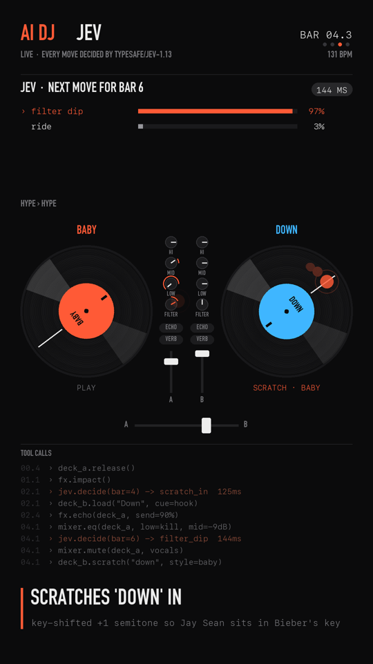

# AI DJ

**An AI with its hands on the decks.** Not a music generator: it plays real songs and *performs* them with real DJ
moves (scratches, loop rolls, spinbacks, crossfader chops, EQ bass swaps), where every move is a tool call.

Demo sets: **[yask.dev/dj](https://yask.dev/dj)**



- **The brain is [Jev](https://docs.typesafe.ai)** (TypeSafe's typed-decision model). Every couple of bars it answers
  one call with four typed questions (*which move*, *which song next*, *which scratch technique*, *how hard should it hit*)
  in ~150 ms.
- **It's live, with a delay.** Audio renders two bars behind the decisions (~4 s). A brain slower than that misses the
  move and the set falls back, like a real DJ fumbling. Jev never misses; LLMs sometimes do.
- **The DSP is real.** Stem separation, beat-locked time-stretch, key shifting, a scratch synth that models the platter
  and crossfader, stateful EQ/filters, echo/reverb sends, a master bus.
- **The visuals are telemetry.** Every platter wobble, knob turn and fingertip in the video is drawn from what the engine
  actually did, 30 times a second.

<br clear="right">

## How it works

```
 YouTube / your files ──► prep (slow, once per song)                      perform (fast, every bar)
                          ├─ Demucs: drums · bass · vocals · other        ├─ conductor: phrasing, legal moves, variety
                          ├─ beat-this: beat + downbeat grid              ├─ brain: Jev (or any LLM) picks the move   ◄─ ~150 ms
                          ├─ hot cues: hook bars + a word to scratch      ├─ engine: renders the bar (~30 ms)
                          └─ time-stretch / key-shift to master tempo     └─ telemetry ─► stage.py ─► the video
```

Code stays in control of timing and phrasing. The model only makes narrow, typed decisions, which is what Jev is
designed for. Variety is enforced in code (recently used moves and scratch styles are removed from the options).

**Moves** (the brain's tools): `scratch_in`, `chop_cut`, `echo_out_cut`, `spinback_cut`, `brake_cut`, `roll_build_cut`,
`drop_gap_cut`, `scratch_fill`, `roll_fill`, `echo_throw`, `filter_dip`, `ride`.
**Scratch techniques:** baby, chirp, transformer, scribble, tear, flare.

## Run it

Needs macOS or Linux, Python 3.12, `ffmpeg`, `rubberband`, `yt-dlp` (and ideally an Apple Silicon or CUDA GPU for Demucs).

```bash
brew install ffmpeg rubberband yt-dlp          # or your package manager
uv venv --python 3.12 .venv && uv pip install --python .venv/bin/python -r requirements.txt
echo "sk-or-..." > .openrouter_key             # an OpenRouter key: serves Jev (typesafe/jev-1.13) and the LLMs
.venv/bin/python server.py                     # → http://localhost:8765
```

Pick two songs, pick a brain, hit **DROP IT**. First-time songs take ~45 s (download, stems, analysis), then it's cached.

**CLI** with a hand-prepped crate (`crate.json`: hook bars and scratch words from Whisper word timings, see `prep_crate.py`):

```bash
.venv/bin/python live.py --brain jev --bars 20 --name myset   # decisions + audio + telemetry → out/
.venv/bin/python stage.py out/myset                          # → out/myset.stage.mp4
.venv/bin/python live.py --brain jev --live                   # through your speakers; type requests while it plays
```

`--brain` takes `jev`, `random`, or any OpenRouter model id (e.g. `anthropic/claude-haiku-4.5`).
Jev is reached through OpenRouter's System One passthrough (`POST /api/v1/systemone`, model `typesafe/jev-1.13`); if you
have a TypeSafe key, put it in `.typesafe_key` to call TypeSafe directly.

## Files

| file | what |
|---|---|
| `live.py` | the performer: tracks, scratch synth, stateful DSP engine, conductor, Jev / LLM / random brains |
| `stage.py` | renders the 1080×1920 "hands on the decks" video from telemetry |
| `mixlab.py` | any-two-songs pipeline: search, download, stems, beat grid, automatic hot cues, tempo matching |
| `server.py`, `web/` | the web app (FastAPI and one HTML file) |
| `dj.py` | analysis (beat grid, key, per-bar stem energy) and the v1 offline engine the first agent sets used |
| `AGENT.md`, `sets/` | v1: an LLM agent writes a whole set as JSON, renders it, reads a listen report and iterates |
| `prep_crate.py`, `transcribe.py` | Whisper word timings, for precise hooks and scratch words |

## Honest notes

- The AI can't hear. It reads structure (per-bar stem energy, phrase position, what's playing) and makes typed decisions.
  The engine does the audio.
- Automatic hook detection is a heuristic (loud, vocal, drum-driven, repeated). Hand-prepped cues sound better.
- Big tempo gaps get stretched ±8% or more, and you can hear it.
- **Music is copyrighted.** This repo contains no audio. Use songs you have the rights to, and don't redistribute other
  people's music.

## Credits

[Jev / TypeSafe](https://typesafe.ai) · [OpenRouter](https://openrouter.ai) ·
[Demucs](https://github.com/adefossez/demucs) · [beat-this](https://github.com/CPJKU/beat_this) ·
[Rubber Band](https://breakfastquay.com/rubberband/) · [Pedalboard](https://github.com/spotify/pedalboard) ·
[yt-dlp](https://github.com/yt-dlp/yt-dlp) · [Whisper (MLX)](https://github.com/ml-explore/mlx-examples)

MIT © Yask Srivastava
